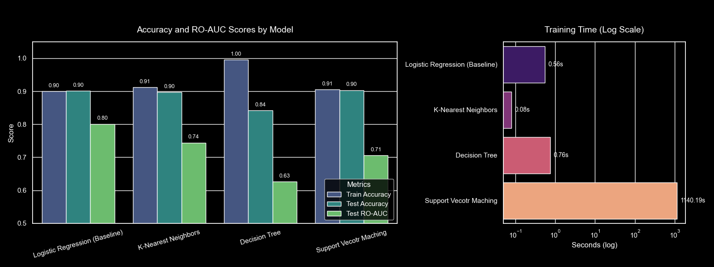
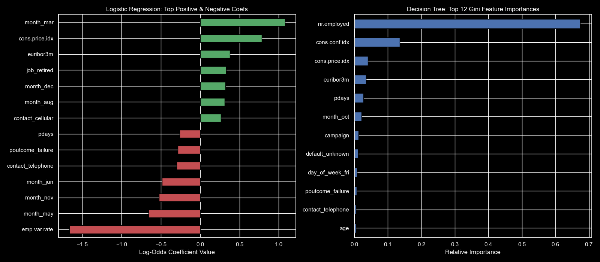

# Comparing Classifiers
# Description
Goal is to compare the performance of the classifiers, namely K Nearest Neighbor, Logistic Regression, Decision Trees, and Support Vector Machines. We will utilize a dataset related to marketing bank products over the telephone. The data is related with direct marketing campaigns (phone calls) of a Portuguese banking institution. The classification goal is to predict if the client will subscribe a term deposit.
# Getting Started
## Code
[Click here for Jupyter Notebook Source Code](https://github.com/sbrithiviraj/direct_market_campaign/blob/main/comparing_classifiers.ipynb "Git")
## Installation
To execute the code below libraries need to be installed
1. matplotlib
2. numpy
3. pandas
4. seaborn
5. sklearn
## Data
Our dataset comes from the UCI Machine Learning repository [Portugese banking institution marketing dataset](https://archive.ics.uci.edu/ml/datasets/bank+marketing).
## Baseline Model comparision (with default values)
### Training accuracy for decision tree is 1 and the test accuracy is 0.84 which clearly shows decision tree algorithm overfits in this scenario
### All other models has both Training and Test accuracy at 0.90
### ROC-AUC evaluates the ranking performance across all decision thresholds independently of class distribution. Logistic Regression has the best Test RO-AUC score.
### K-Nearest Neighbors model was the quickest where as SVM took 1000 times more time than Logistic regression and 10000 times more than K-Nearest Neighbors.

## Hyperparameter tuning
### After hyperparameter tuning Decision tree test accuracy improved a lot. KNN was the fastest model and also the best performing model after tuning.

### Seasonal timing (Mar, Aug & Dec) are in the top possitives. Seasonal Timing (May, Jun & Nov) are most impactful in top negatives. Marketing effectiveness has huge impacts during periods of surging interbank interest rates.

### Employed and retired has more possibility to fall under Yes category

### Previous marketing campaign negatives are still tough to convince.

# Next Steps
### Deploy the tuned Logistic regression / SVM scoring pipeline into the CRM to rank contacts into lift-based targets. Restrict outbound phone outreach to the top 30-40% of scored leads to capture over 75% of all  potential subscribers while cutting call center overhead by more than 50%.

### Automate campaign throttling based on the central bank rate decisions. Accelerate campaigns during the rate cut cycles when term deposits appear more appealing than saving accounts.

### Establish a rule preventing excessive contact attempts as empirical returns decline past 3 attempt without conversation.

# Authors
Brithiviraj Shanmugam
# Version History
* **1.0** (2026-09-02)
    * Initial Version
# Acknowledgements
1. Requirement / idea is for practical application 3 in "Professional Certificate in Machine Learning and Artificial Intelligence" course by UC Berkely